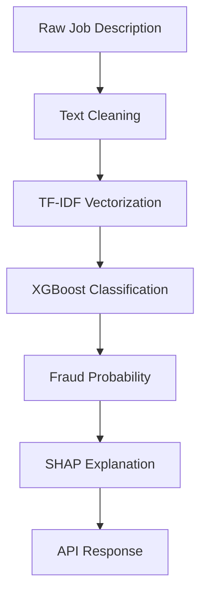

<div align="center">

# JobClarity

**AI-Powered Fake Job Detection System**

Detect fraudulent job postings with Machine Learning and Explainable AI.


**Live App:** [`https://jobclarity.vercel.app`](https://jobclarity.vercel.app) &nbsp;•&nbsp; **Live API:** [`https://jobclarity-0tz8.onrender.com`](https://jobclarity-0tz8.onrender.com) &nbsp;•&nbsp; **Interactive Docs:** [`/docs`](https://jobclarity-0tz8.onrender.com/docs)

</div>

---

## Overview

**JobClarity** is an end-to-end AI-powered system that detects fraudulent job postings before they can trick job seekers. Given any job description, the system classifies it as **Real** or **Fake** using a tuned **XGBoost** classifier trained over TF-IDF vectorized text — then goes one step further with **SHAP** (SHapley Additive exPlanations) to explain *why* the model reached its verdict. The result is surfaced through a clean, responsive **Next.js** dashboard backed by a **FastAPI** REST API, fully containerized with **Docker**, shipped with **GitHub Actions CI**, and deployed independently — the **backend on Render** and the **frontend on Vercel**.

---

## 🔗 Project Links

| Resource | Link |
|----------|------|
| 🌐 Live Application | [https://jobclarity.vercel.app/](https://jobclarity.vercel.app/) |
| 🎨 Frontend Repository | [https://github.com/divysaxena24/JobClarity-frontend](https://github.com/divysaxena24/JobClarity-frontend) |
| ⚙️ Backend Repository | [https://github.com/divysaxena24/JobClarity](https://github.com/divysaxena24/JobClarity) |
| 🚀 Backend API | [https://jobclarity-0tz8.onrender.com](https://jobclarity-0tz8.onrender.com) |
| 📖 Swagger API Docs | [https://jobclarity-0tz8.onrender.com/docs](https://jobclarity-0tz8.onrender.com/docs) |

---

## 🌐 Frontend

The frontend of JobClarity is maintained in a separate repository.

**Frontend Repository**

[https://github.com/divysaxena24/JobClarity-frontend](https://github.com/divysaxena24/JobClarity-frontend)

**Live Application**

[https://jobclarity.vercel.app/](https://jobclarity.vercel.app/)

**Frontend Tech Stack**

- Next.js 16
- TypeScript
- Tailwind CSS
- Framer Motion
- Axios

> The frontend provides a modern responsive SaaS interface for analyzing job postings. It communicates with this FastAPI backend through REST APIs to perform real-time AI-powered fake job detection and display explainable SHAP results.

---

## Table of Contents

- [Project Links](#-project-links)
- [Frontend](#-frontend)
- [Features](#features)
- [Demo](#demo)
- [Project Structure](#project-structure)
- [Tech Stack](#tech-stack)
- [Machine Learning Pipeline](#machine-learning-pipeline)
- [API Endpoints](#api-endpoints)
- [Docker](#docker)
- [Local Installation](#local-installation)
- [Deployment](#deployment)
- [Model Output](#model-output)
- [Testing](#testing)
- [Screenshots](#screenshots)
- [Future Improvements](#future-improvements)
- [Author](#author)
- [License](#license)

---

## Features

The complete application includes:

- **AI-powered Fake Job Detection** — tuned XGBoost classifier trained to spot fraudulent postings
- **XGBoost Classification** — gradient-boosted classifier trained over TF-IDF vectorized text
- **SHAP Explainability** — per-prediction feature attributions via `TreeExplainer`
- **Fraud Probability Prediction** — probability that a posting belongs to the *Fake* class
- **Fraud Risk Score (0–100)** — an interpretable 0–100 risk score for any job description
- **Risk Level Classification** — Low / Medium / High / Critical severity tiers
- **Top Contributing Features** — the top 10 features driving each verdict, with direction & impact
- **FastAPI REST API** — lightweight, high-performance inference backend
- **Interactive Swagger Documentation** — auto-generated OpenAPI UI at `/docs`
- **Responsive Next.js Frontend** — modern SaaS dashboard with TypeScript, Tailwind CSS & Framer Motion
- **REST API Integration** — frontend communicates with the backend over Axios
- **Dockerized Backend** — single-container build with built-in health check
- **GitHub Actions CI** — dependency, import & Docker build verification on every push/PR
- **Render Deployment** — backend live at a public HTTPS endpoint
- **Vercel Deployment** — frontend live at [`https://jobclarity.vercel.app/`](https://jobclarity.vercel.app/)
- **Health Check Endpoint** — `GET /health` reports model & vectorizer readiness
- **Input Validation** — Pydantic-validated requests (min. description length enforced)
- **Error Handling** — typed, user-friendly error responses surfaced in the UI

---

## Demo

The application is split into a **Next.js frontend** (deployed on Vercel) and a **FastAPI backend** (deployed on Render), communicating over a REST API.

| Layer | Technology |
|---|---|
| **Frontend** | Next.js 16, TypeScript, Tailwind CSS, shadcn/ui, Framer Motion |
| **Backend** | FastAPI, XGBoost, SHAP, Docker, Render |

### Architecture Flow

```
User
        │
        ▼
Next.js Frontend (Vercel)
        │
        │ REST API
        ▼
FastAPI Backend (Render)
        │
        ▼
XGBoost Model
        │
        ▼
SHAP Explainability
```

The **frontend and backend are deployed independently** — the Next.js app runs on Vercel and talks to the FastAPI service on Render over HTTPS, so each layer can be scaled, redeployed, and versioned on its own.

---

## Project Structure

<details>
<summary><b>Backend — <code>JobClarity/</code></b></summary>

```
JobClarity/
├── src/
│   ├── api/                # FastAPI routes, schemas, prediction service
│   │   ├── main.py         # App factory, CORS, router registration
│   │   ├── routes.py       # GET /, GET /health, POST /predict
│   │   ├── schemas.py      # Pydantic request/response models
│   │   └── predictor.py    # Inference orchestration (clean → vectorize → predict → explain)
│   ├── explainability/
│   │   └── shap_explainer.py   # SHAP TreeExplainer + top-K feature extraction
│   ├── features/           # TF-IDF vectorization & feature engineering
│   ├── models/
│   │   ├── model_loader.py # Loads trained model & vectorizer artifacts
│   │   └── model_trainer.py
│   ├── preprocessing/
│   │   ├── text_cleaner.py # HTML/URL/email/phone removal, normalization
│   │   └── utils.py
│   └── utils/
├── models/                 # Trained artifacts (XGBoost, TF-IDF vectorizer)
├── tests/                  # Test suite
├── configs/                # Configuration files
├── .github/workflows/
│   └── ci.yml              # GitHub Actions CI pipeline
├── Dockerfile              # Container definition (Python 3.12-slim)
├── docker-compose.yml      # Local orchestration (port 8000)
└── requirements.txt        # Python dependencies
```

</details>

<details>
<summary><b>Frontend — <code>jobclarity-frontend/</code></b></summary>

```
jobclarity-frontend/
├── app/
│   ├── page.tsx            # Landing page (hero + analyzer + report)
│   ├── layout.tsx          # Root layout
│   └── globals.css         # Global styles / Tailwind theme
├── components/
│   ├── layout/             # Navbar, Hero, HeroBackground, Features, Footer
│   ├── analyzer/           # AnalyzerCard, SampleJobs
│   ├── prediction/         # PredictionDashboard, PredictionSummary, ReasonList, ...
│   └── ui/                 # shadcn/ui components (button, card, badge, ...)
├── lib/
│   ├── api/client.ts       # Axios client with typed, friendly error handling
│   └── utils.ts            # `cn()` class merge helper
├── types/
│   └── prediction.ts       # Prediction request/response types
├── components.json         # shadcn/ui configuration
└── package.json
```

> **Note:** the frontend is also maintained as its own repository — see the [Frontend](#-frontend) section.

</details>

---

## Tech Stack

| Category | Technology | Purpose |
|---|---|---|
| **Frontend** | [Next.js](https://nextjs.org) | React framework (App Router) & SSR |
| | [React](https://react.dev) | UI library |
| | [TypeScript](https://www.typescriptlang.org) | Typed JavaScript |
| | [Tailwind CSS](https://tailwindcss.com) | Utility-first styling |
| | [shadcn/ui](https://ui.shadcn.com) | Accessible component library |
| | [Framer Motion](https://www.framer.com/motion/) | UI animations |
| | [Axios](https://axios-http.com) | HTTP client for API calls |
| **Backend** | [FastAPI](https://fastapi.tiangolo.com) | Async Python REST framework |
| | Python 3.12 | Core language |
| | [Pydantic](https://docs.pydantic.dev) | Request/response validation |
| | [Uvicorn](https://www.uvicorn.org) | ASGI server |
| **Machine Learning** | [XGBoost](https://xgboost.readthedocs.io) | Gradient-boosted classifier |
| | TF-IDF | Text vectorization (scikit-learn) |
| | [SHAP](https://shap.readthedocs.io) | Model explainability |
| | scikit-learn | ML utilities & vectorizer |
| | pandas / numpy | Data processing |
| **DevOps** | [Docker](https://www.docker.com) | Containerization |
| | [GitHub Actions](https://github.com/features/actions) | CI/CD |
| | [Render](https://render.com) | Backend cloud hosting |
| | [Vercel](https://vercel.com) | Frontend cloud hosting |
| | Git | Version control |

---

## Machine Learning Pipeline



**Inference pipeline** (implemented in `src/api/predictor.py`):

1. **Text Cleaning** — strips HTML, URLs, emails, phone numbers and special characters; lowercases and normalizes whitespace (`src/preprocessing/text_cleaner.py`).
2. **TF-IDF Vectorization** — transforms the cleaned text using the saved `tfidf_vectorizer.pkl`.
3. **XGBoost Classification** — the tuned `xgboost_model_tuned.pkl` predicts *Real* vs *Fake*.
4. **Fraud Probability** — `predict_proba` yields the probability of the *Fake* class, converted to a 0–100 risk score.
5. **SHAP Explanation** — `TreeExplainer` computes feature attributions; the **top 10 features** are returned with impact and effect direction.
6. **API Response** — the verdict, risk metrics, and explanations are returned as JSON.

**Risk Level thresholds** (`src/api/predictor.py`):

| Risk Score | Level |
|---|---|
| 0 – 25 | Low |
| 26 – 50 | Medium |
| 51 – 75 | High |
| 76 – 100 | Critical |

---

## API Endpoints

| Method | Endpoint | Description |
|---|---|---|
| `GET` | `/` | Project info, API version, links to docs & health |
| `GET` | `/health` | Service health, model & vectorizer load status |
| `POST` | `/predict` | Analyze a job description for fraud |
| `GET` | `/docs` | Interactive Swagger UI (OpenAPI) |

<details>
<summary><b>GET <code>/health</code> — example response</b></summary>

```json
{
  "status": "healthy",
  "model_loaded": true,
  "vectorizer_loaded": true,
  "version": "1.0.0"
}
```

</details>

<details>
<summary><b>POST <code>/predict</code> — example request</b></summary>

```bash
curl -X POST https://jobclarity-0tz8.onrender.com/predict \
  -H "Content-Type: application/json" \
  -d '{
    "job_description": "Work from home, earn $5000 per week, no experience needed. Pay a one-time activation fee to receive your first assignment."
  }'
```

```json
{
  "job_description": "Work from home, earn $5000 per week, no experience needed. Pay a one-time activation fee to receive your first assignment."
}
```

> **Note:** `job_description` must be **at least 20 characters** long (Pydantic-validated).

</details>

<details>
<summary><b>POST <code>/predict</code> — example response</b></summary>

```json
{
  "prediction": "Fake",
  "fraud_probability": 0.9234,
  "fraud_risk_score": 92,
  "risk_level": "Critical",
  "top_reasons": [
    {
      "feature": "activate",
      "impact": 2.3456,
      "effect": "Increases fraud risk"
    },
    {
      "feature": "earn",
      "impact": 1.8912,
      "effect": "Increases fraud risk"
    },
    {
      "feature": "experience",
      "impact": -0.7401,
      "effect": "Decreases fraud risk"
    }
  ],
  "model_version": "1.0.0"
}
```

</details>

---

## Docker

The backend ships with a **multi-purpose `Dockerfile`** (Python 3.12-slim) featuring a built-in health check and a `docker-compose.yml` for local orchestration.

<details>
<summary><b>Build & run with Docker</b></summary>

```bash
# Build the image
docker build -t jobclarity .

# Run the container
docker run -p 8000:8000 jobclarity

# Verify the health check
curl http://localhost:8000/health
```

</details>

<details>
<summary><b>Or use Docker Compose</b></summary>

```bash
# Build & start (with model volume mount)
docker compose up --build

# Stop
docker compose down
```

</details>

---

## Local Installation

### Backend

```bash
# 1. Clone the repository
git clone https://github.com/divysaxena24/JobClarity.git
cd JobClarity

# 2. Create and activate a virtual environment
python -m venv .venv
# Windows:   .venv\Scripts\activate
# macOS/Linux: source .venv/bin/activate

# 3. Install dependencies
pip install -r requirements.txt

# 4. Start the API server
uvicorn src.api.main:app --reload
```

The API is now live at **http://localhost:8000** — open **http://localhost:8000/docs** for the Swagger UI.

### Frontend

```bash
# 1. Clone the frontend repository
git clone https://github.com/divysaxena24/JobClarity-frontend.git
cd jobclarity-frontend

# 2. Install dependencies
npm install

# 3. Start the dev server
npm run dev
```

The frontend is now live at **http://localhost:3000**.

> **Tip:** The frontend reads the backend URL from `NEXT_PUBLIC_API_BASE_URL`. It defaults to the live Render deployment, so you can point it at `http://localhost:8000` for local development:
>
> ```bash
> NEXT_PUBLIC_API_BASE_URL=http://localhost:8000 npm run dev
> ```

---

## Deployment

The frontend and backend are **deployed independently**:

| Layer | Platform | URL |
|---|---|---|
| **Backend** | [Render](https://render.com) | [https://jobclarity-0tz8.onrender.com](https://jobclarity-0tz8.onrender.com) |
| **Frontend** | [Vercel](https://vercel.com) | [https://jobclarity.vercel.app/](https://jobclarity.vercel.app/) |

- **Backend Deployment** — containerized with Docker and deployed to **Render** at `https://jobclarity-0tz8.onrender.com` (Swagger docs at `/docs`).
- **Frontend Deployment** — built with Next.js (`npm run build`) and deployed to **Vercel** at `https://jobclarity.vercel.app/`.
- **Dockerized backend** — the production image is identical to the local image (Python 3.12-slim + Uvicorn on port 8000).
- **GitHub Actions CI** — `.github/workflows/ci.yml` runs on every push/PR to `main`:
  - Python 3.12 setup + dependency installation
  - Import verification for `fastapi`, `pandas`, `sklearn`, `xgboost`, `shap`
  - Docker image build (`jobclarity-ci`) to catch regressions early
- **Automatic deployment on push** — pushing to `main` triggers CI and the deployment pipeline.

---

## Model Output

Every `/predict` call returns a structured response powering the frontend dashboard:

| Field | Type | Description |
|---|---|---|
| `prediction` | `string` | Verdict: `"Real"` or `"Fake"` |
| `fraud_probability` | `float` | Probability of the *Fake* class (0 – 1) |
| `fraud_risk_score` | `int` | 0 – 100 risk score |
| `risk_level` | `string` | `Low` / `Medium` / `High` / `Critical` |
| `top_reasons` | `array` | Top 10 SHAP features — `feature`, `impact`, `effect` |
| `model_version` | `string` | Version of the deployed model (`1.0.0`) |

These are rendered in the UI as the **AI Fraud Detection Report** (verdict, animated risk gauge, probability & confidence indicators) and the **Key Factors Behind the Prediction** panel (top contributing SHAP features with impact direction).

---

## Testing

| Check | How |
|---|---|
| Health endpoint | `curl http://localhost:8000/health` → `{"status": "healthy", ...}` |
| Swagger | Open `http://localhost:8000/docs`, run a test `/predict` call |
| Frontend integration | Submit a job description on `localhost:3000` and verify the report renders |
| Docker | `docker compose up --build` and hit `localhost:8000/health` |
| Render deployment | Query the live API at `https://jobclarity-0tz8.onrender.com/health` |
| GitHub Actions | View pipeline status on any push/PR to `main` |

---

## Future Improvements

- **Better scam detection** — specialized detectors for MLM, crypto, and advance-fee scams
- **BERT / Transformer models** — fine-tuned LLMs for higher accuracy over TF-IDF
- **OCR support** — analyze job postings from images & PDFs
- **Resume matching** — compare candidates against real opportunities
- **Job recommendation** — suggest legitimate roles based on user profiles
- **Batch predictions** — analyze multiple postings in a single request
- **User authentication** — accounts, saved analyses, and history
- **Dashboard analytics** — fraud trends and statistics over time
- **Database support** — persist predictions, feedback, and flagged postings
- **Admin panel** — review flagged postings and model feedback
- **Browser extension** — one-click fraud checks while browsing job boards

---

## Author

**Divya Saxena**

Computer Science Engineering Student<br>
Machine Learning | AI | Full Stack | DevOps

- **GitHub:** [github.com/divysaxena24](https://github.com/divysaxena24)
- **LinkedIn:** [linkedin.com/in/divyasaxena](https://www.linkedin.com/in/divyasaxena24/) 

> If you find this project useful, consider giving it a star!

---

## License

This project is licensed under the **MIT License** — see the [LICENSE](LICENSE) file for details.

---

<div align="center">

**JobClarity** — *Detect fake jobs. Restore trust in job hunting.*

</div>
